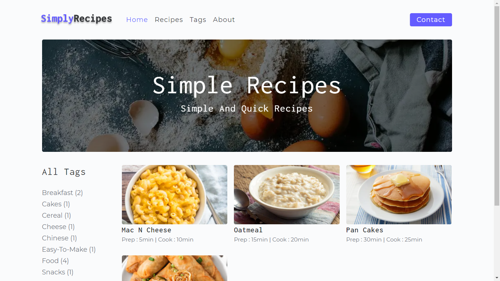
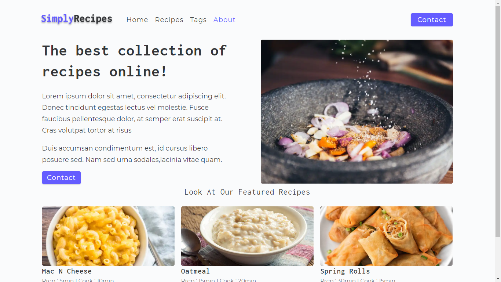
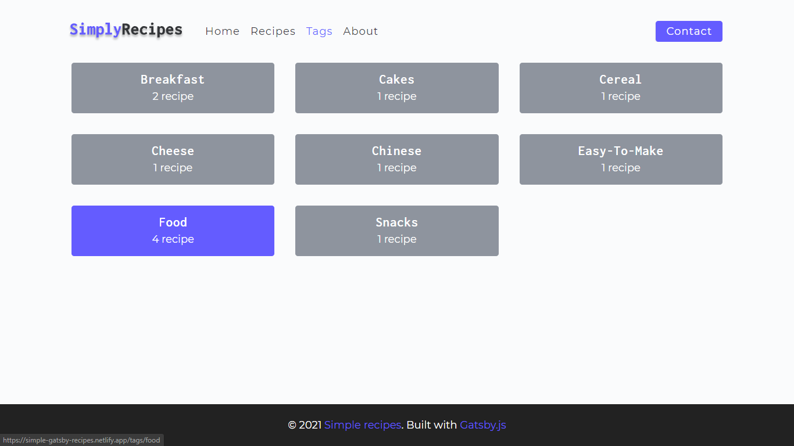
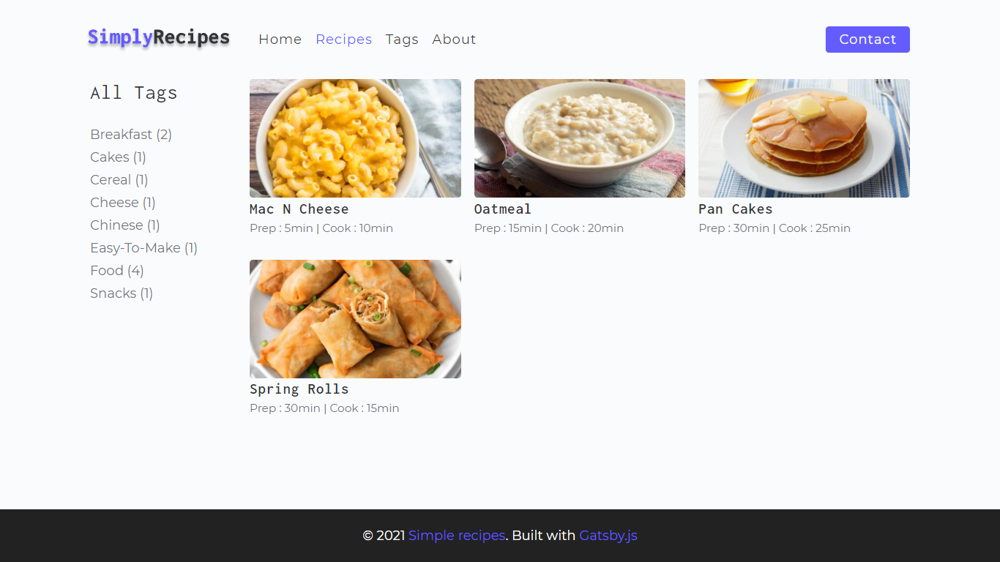
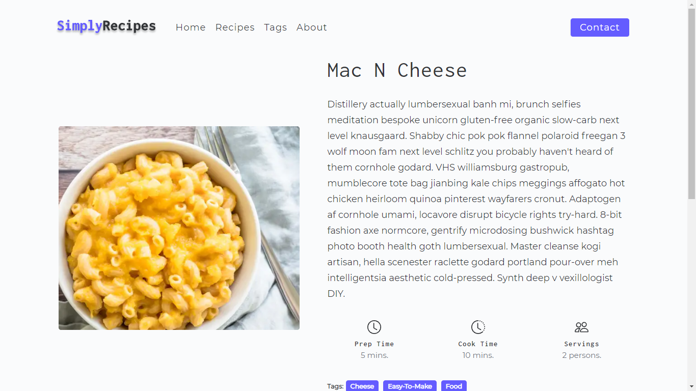

<!-- AUTO-GENERATED-CONTENT:START (STARTER) -->
<p align="center">
  <a href="https://www.gatsbyjs.com">
    
  </a>
</p>
<h1 align="center">
  simple-recipes-gatsby 
</h1>

An online cooking recipes blogs made using <a href="https://www.gatsbyjs.com">Gatsby.js</a> and <a href="https://www.contentful.com/">Contentful</a> and uses <a href="https://www.formspree.io">FormSpree</a> for handling form inputs, This website is deployed on the <a href="https://www.netlify.com/">Netlify</a> platform. You can find the live version <a href="https://simple-gatsby-recipes.netlify.app/">Using this link<a/>

## 🚀 Quick start:

1.  **Start the development build.**

    Navigate into the root directory and start it up.

    ```shell
    gatsby develop
    ```

## 🚀 Screenshots:

 <h4>Home Page</h4>

 <h4>About Page</h4>

 <h4>Tags Page</h4>

 <h4>Recipe Page</h4>

 <h4>Single recipe Page</h4>

## 💫 Deployment:

[This Site is deployed live here](https://simple-gatsby-recipes.netlify.app/)
